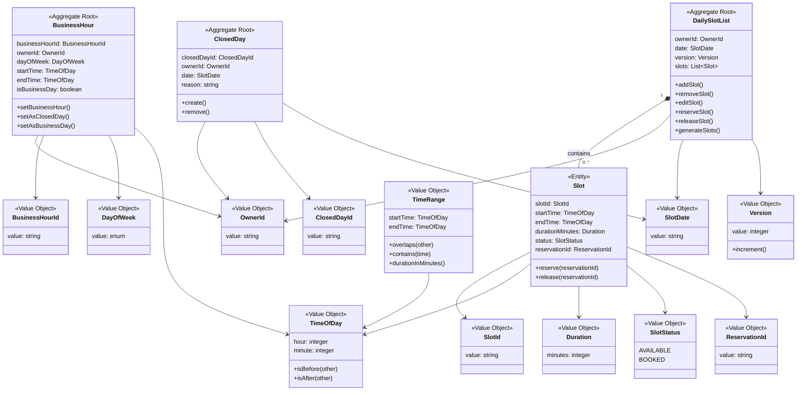
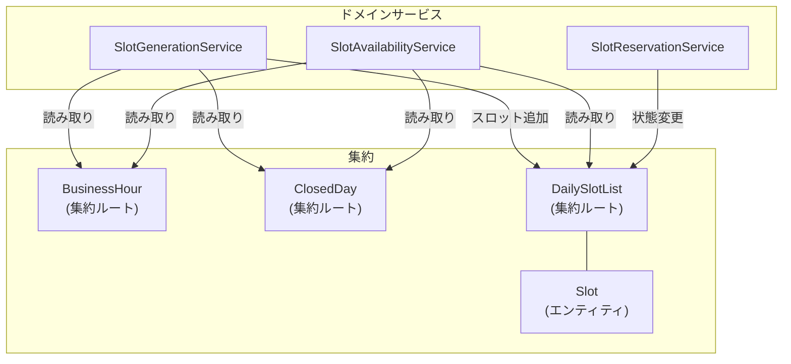
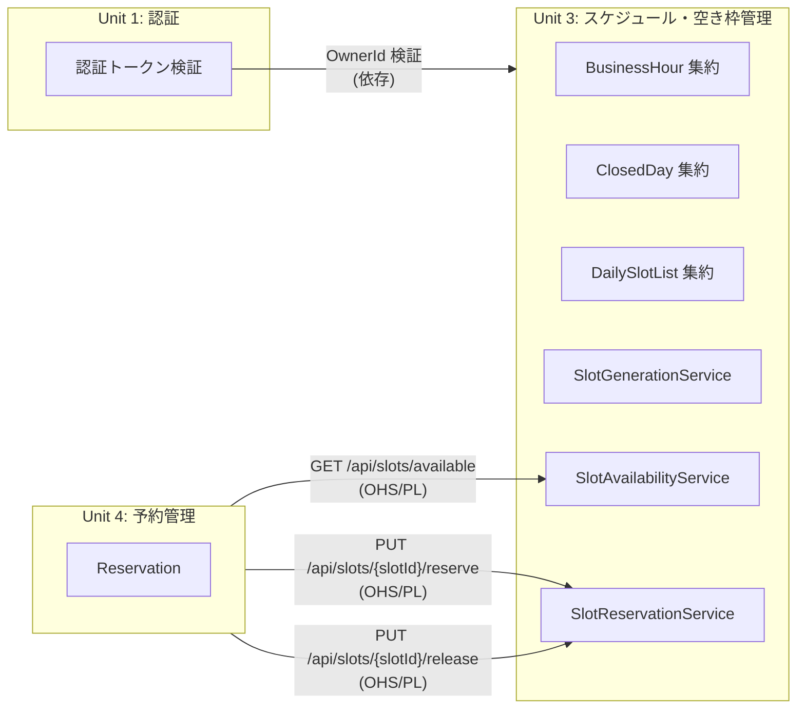
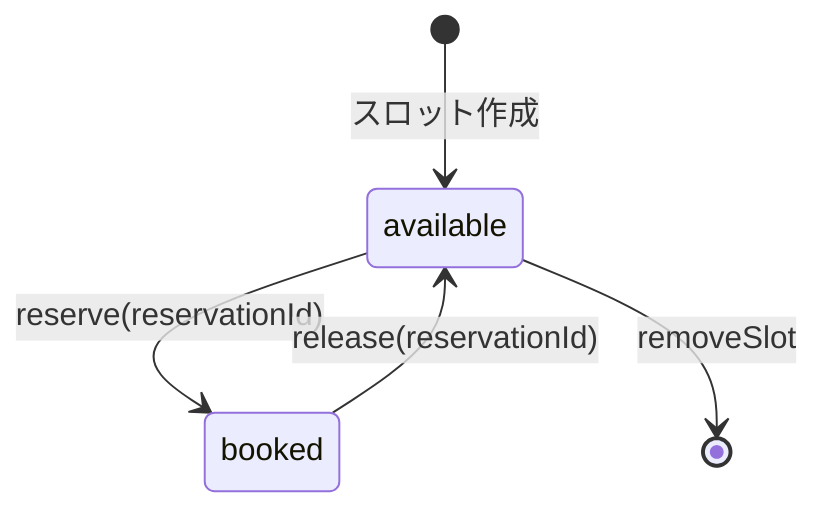

# Unit 3: ドメインモデル関連図

## 全体構造図

## ドメインサービスと集約の関係図

## ユニット境界図（コンテキストマップ）

## スロット状態遷移図

## 凡例

| 記号 | 意味 |
|------|------|
| Aggregate Root | 集約ルート。外部からのアクセスポイント |
| Entity | エンティティ。識別子を持つドメインオブジェクト |
| Value Object | 値オブジェクト。不変で等価性で比較されるオブジェクト |
| *-- (実線ダイヤ) | コンポジション（集約内の構成要素） |
| --> (矢印) | 利用関係・依存 |
| OHS/PL | Open Host Service / Published Language パターン（PACT 契約） |
