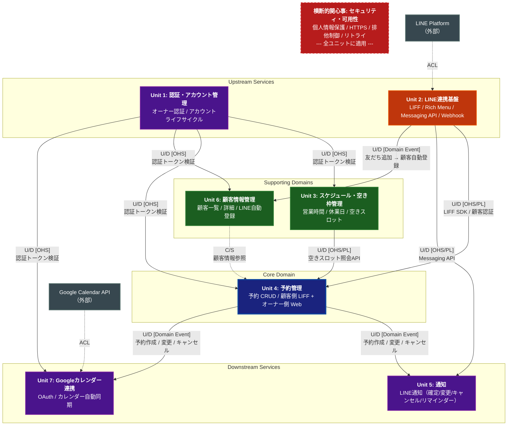

# コンテキストマップ

## 概要

7つの境界づけられたコンテキスト（Unit）と横断的関心事の関係性を示す。
Unit 4（予約管理）をコアドメインとし、他のユニットがそれを支える構造となっている。

## 凡例

| 略称 | 統合パターン | 説明 |
|------|-------------|------|
| U/D | Upstream / Downstream | 上流が下流にデータ・機能を提供する関係 |
| OHS | Open Host Service | 標準化されたAPIを公開し、複数の下流が利用する |
| PL | Published Language | 共有された公開インターフェース仕様 |
| ACL | Anti-Corruption Layer | 外部モデルの影響を遮断する変換層 |
| C/S | Customer / Supplier | 下流の要求に応じて上流が提供内容を調整する |

## コンテキストマップ図

## 関係性の詳細

### Unit 1（認証・アカウント管理） → Unit 3, 4, 6, 7

- **パターン**: Open Host Service（OHS）
- **方向**: Unit 1 が上流
- **内容**: Web管理画面を利用する全ユニットに認証・認可機能を提供。オーナーのセッション管理とアクセス制御を一元的に担う。

### Unit 2（LINE連携基盤） → Unit 4（予約管理）

- **パターン**: Open Host Service / Published Language（OHS/PL）
- **方向**: Unit 2 が上流
- **内容**: LIFF SDK を通じて顧客側の予約UIをLINEアプリ内で提供。LINEユーザー認証情報を Unit 4 に引き渡す。リッチメニューから予約操作への導線を提供。

### Unit 2（LINE連携基盤） → Unit 5（通知）

- **パターン**: Open Host Service / Published Language（OHS/PL）
- **方向**: Unit 2 が上流
- **内容**: Messaging API のラッパーを提供し、Unit 5 がLINEメッセージを送信するための基盤となる。

### Unit 2（LINE連携基盤） → Unit 6（顧客情報管理）

- **パターン**: Domain Event
- **方向**: Unit 2 が上流
- **内容**: 顧客がLINE公式アカウントを友だち追加した際、Webhookイベントを発火し、Unit 6 で顧客情報（LINE ユーザーID・表示名）を自動登録する。

### Unit 3（スケジュール・空き枠管理） → Unit 4（予約管理）

- **パターン**: Open Host Service / Published Language（OHS/PL）
- **方向**: Unit 3 が上流
- **内容**: 営業時間・休業日・空きスロット情報を照会APIとして公開。Unit 4 は予約作成・変更時にこのAPIを利用して空き状況を確認する。

### Unit 6（顧客情報管理） ↔ Unit 4（予約管理）

- **パターン**: Customer / Supplier（C/S）
- **方向**: Unit 6 が Supplier、Unit 4 が Customer
- **内容**: Unit 4 は予約作成時に顧客情報を参照する。オーナーが手動予約を作成する際に既存顧客を選択、または予約詳細に顧客名を表示する。Unit 4 の要件に応じて Unit 6 が顧客データの提供方法を調整する。

### Unit 4（予約管理） → Unit 5（通知）

- **パターン**: Domain Event
- **方向**: Unit 4 が上流
- **内容**: 予約の作成・変更・キャンセルイベントを発行。Unit 5 がこれを購読し、顧客向け（確定/変更/キャンセル通知）およびオーナー向け（新規予約/変更/キャンセル通知）のLINEメッセージを送信する。

### Unit 4（予約管理） → Unit 7（Googleカレンダー連携）

- **パターン**: Domain Event
- **方向**: Unit 4 が上流
- **内容**: 予約の作成・変更・キャンセルイベントを発行。Unit 7 がこれを購読し、Googleカレンダーへの予定の追加・更新・削除を自動実行する。

### 外部システム連携

- **LINE Platform → Unit 2**: ACL（Anti-Corruption Layer）を介してLINE APIの外部モデルをシステム内部モデルに変換
- **Google Calendar API → Unit 7**: ACL を介してGoogle APIの外部モデルをシステム内部モデルに変換

### 横断的関心事（セキュリティ・可用性）

全ユニットに適用される非機能要件。特に以下のユニットでの適用が重要:
- **Unit 2（LINE連携基盤）**: Webhookリトライ処理
- **Unit 4（予約管理）**: 二重予約防止の排他制御
- **Unit 6（顧客情報管理）**: 個人情報の暗号化保存
