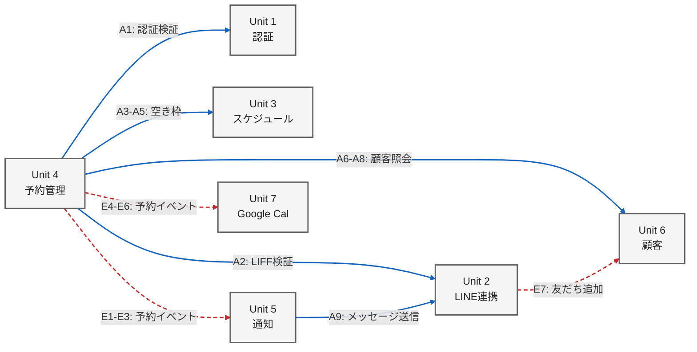

# ユニット間連携定義

## 連携一覧

### 同期 API（HTTP）

| # | Consumer | Provider | エンドポイント | 用途 | PACT |
|---|----------|----------|---------------|------|------|
| A1 | Unit 3,4,6,7 | Unit 1 | `POST /api/auth/verify` | 認証トークン検証 | [unit4-unit1-auth.pact.json](./unit4-unit1-auth.pact.json) |
| A2 | Unit 4 | Unit 2 | `POST /api/line/liff/verify` | LIFF アクセストークン検証 | [unit4-unit2-liff.pact.json](./unit4-unit2-liff.pact.json) |
| A3 | Unit 4 | Unit 3 | `GET /api/slots/available` | 空きスロット照会 | [unit4-unit3-slots.pact.json](./unit4-unit3-slots.pact.json) |
| A4 | Unit 4 | Unit 3 | `PUT /api/slots/{slotId}/reserve` | スロット予約確保 | 同上 |
| A5 | Unit 4 | Unit 3 | `PUT /api/slots/{slotId}/release` | スロット解放 | 同上 |
| A6 | Unit 4 | Unit 6 | `GET /api/customers/{customerId}` | 顧客情報取得 | [unit4-unit6-customer.pact.json](./unit4-unit6-customer.pact.json) |
| A7 | Unit 4 | Unit 6 | `GET /api/customers/by-line-user` | LINE ユーザーID で顧客検索 | 同上 |
| A8 | Unit 4 | Unit 6 | `GET /api/customers/search` | 顧客名検索（手動予約用） | 同上 |
| A9 | Unit 5 | Unit 2 | `POST /api/line/messages/push` | LINE プッシュメッセージ送信 | [unit5-unit2-messaging.pact.json](./unit5-unit2-messaging.pact.json) |

### 非同期イベント（Message）

| # | Consumer | Provider | イベント名 | 用途 | PACT |
|---|----------|----------|-----------|------|------|
| E1 | Unit 5 | Unit 4 | `reservation.created` | 予約確定通知トリガー | [unit5-unit4-reservation-events.pact.json](./unit5-unit4-reservation-events.pact.json) |
| E2 | Unit 5 | Unit 4 | `reservation.modified` | 予約変更通知トリガー | 同上 |
| E3 | Unit 5 | Unit 4 | `reservation.cancelled` | 予約キャンセル通知トリガー | 同上 |
| E4 | Unit 7 | Unit 4 | `reservation.created` | Google カレンダー予定追加 | [unit7-unit4-reservation-events.pact.json](./unit7-unit4-reservation-events.pact.json) |
| E5 | Unit 7 | Unit 4 | `reservation.modified` | Google カレンダー予定更新 | 同上 |
| E6 | Unit 7 | Unit 4 | `reservation.cancelled` | Google カレンダー予定削除 | 同上 |
| E7 | Unit 6 | Unit 2 | `line.friend_added` | 顧客自動登録トリガー | [unit6-unit2-line-webhook-events.pact.json](./unit6-unit2-line-webhook-events.pact.json) |

## 連携フロー図

**実線（青）**: 同期 API 呼び出し / **破線（赤）**: 非同期イベント

## 備考

- A1 の認証検証は Unit 3, 4, 6, 7 で共通。代表として Unit 4 の PACT を定義し、他ユニットも同一契約に準拠する。
- E1-E3 と E4-E6 は同一イベントの異なる Consumer。各 Consumer が必要とするフィールドを個別の PACT で定義する。
- イベントの配信基盤（メッセージブローカー）の選定は Elaboration フェーズで決定する。
